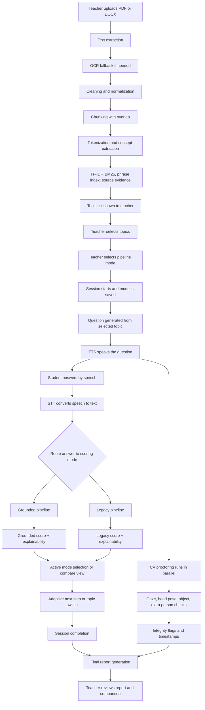
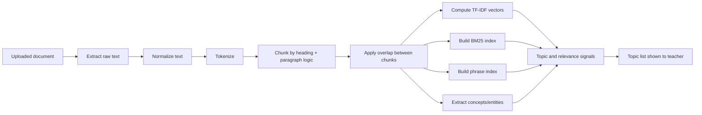
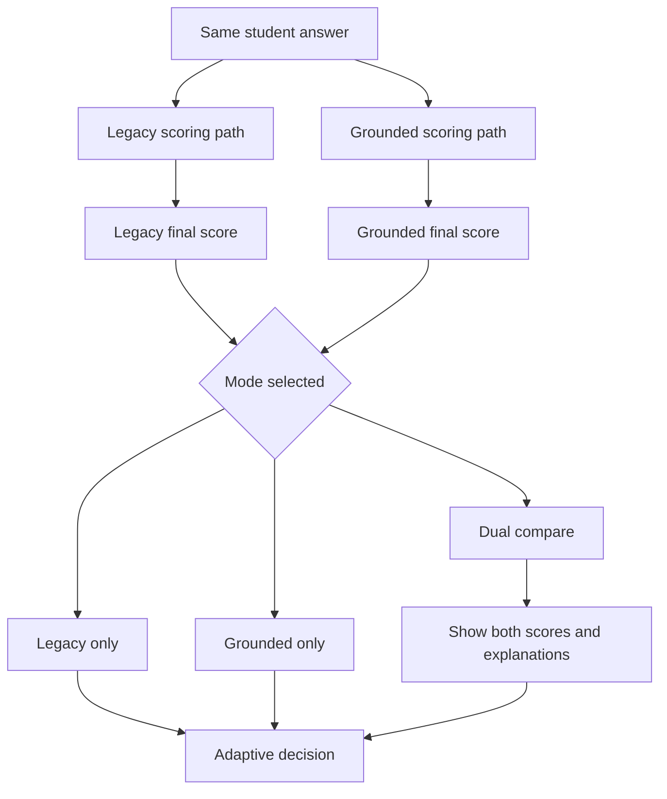

# Automatic Viva Taker — Complete Project Explanation

## 1. Problem Statement
Traditional viva examinations have major challenges:
- They consume heavy faculty time.
- Evaluation can vary by examiner mood and style.
- Online and remote settings make fair monitoring difficult.
- It is hard to maintain both depth checking and consistency at scale.

This project solves that by building an AI-driven viva platform where:
- Teacher provides source material.
- System prepares topic-aware knowledge from that material.
- Student gets adaptive questioning.
- Answers are scored through explainable NLP logic.
- Proctoring runs in parallel through computer vision.
- Final report is generated with performance + integrity context.

The core objective is a fair, explainable, scalable viva system with a teacher-controlled pipeline mode.

---

## 2. Complete Tech Stack

### Frontend
- React
- React Router
- Axios
- Vite

### Backend
- FastAPI
- Uvicorn
- SQLAlchemy
- SQLite
- python-dotenv
- python-multipart

### NLP, Retrieval, and Text Processing
- sentence-transformers
- scikit-learn
- rank-bm25
- pypdf
- python-docx
- pdf2image
- pytesseract

### LLM Layer
- OpenAI-compatible SDK usage for LLM-based generation/evaluation flows in project design

### Speech
- faster-whisper (STT)
- pyttsx3 (TTS)

### Computer Vision
- OpenCV
- MediaPipe
- YOLOv8 (Ultralytics)

---

## 3. Methods Used (Core Concepts)
- Text extraction from PDF and DOCX
- OCR fallback for scanned documents
- Text cleaning and normalization
- Tokenization
- Stemming/normal-form processing
- Concept extraction (nouns, phrases, entities)
- Chunking with overlap
- TF-IDF vectorization
- BM25 ranking
- Phrase indexing
- Rubric construction from retrieved source chunks
- Topic-conditioned question generation
- STT transcription
- TTS playback
- Dual-pipeline evaluation
- Semantic similarity scoring
- Keyword coverage scoring
- Key-point/completeness checking
- Depth/reasoning assessment
- Confidence/fluency scoring
- Wrongness checks:
  - negation conflict
  - antonym conflict
  - factual mismatch
  - relation reversal
  - contradiction
  - off-topic detection
- Feature fusion and weighted scoring
- Adaptive viva decision logic
- CV integrity checks:
  - gaze behavior
  - head pose
  - object detection
  - extra-person detection
- Session report generation (including integrity summary)

---

## 4. End-to-End System Flow



---

## 5. Chunking and Topic-Building Flow (Detailed)



---

## 6. Grounded Pipeline (Detailed)
This path is source-grounded and chunk-aware.

### Grounded pipeline logic
1. Teacher-selected topic and generated question are tied to source chunk context.
2. Student answer text is preprocessed:
   - tokenization
   - normalization
   - content cleanup
   - value/notation handling
3. Feature extraction runs against rubric and source evidence:
   - concept coverage
   - phrase match
   - TF-IDF similarity
   - BM25 relevance
   - overlap/recall signals
   - discourse/quality signals
4. Wrongness checks apply penalties for conflicts and contradictions.
5. Weighted fusion computes raw grounded score.
6. Level bonus and policy penalties are applied.
7. Final grounded score is clamped to valid range.
8. Explainability payload is prepared (matched/missing concepts, penalties, reasons).

### Grounded score formula used in the project

The grounded pipeline first builds these intermediate proxies:

```text
semantic proxy = 0.40(concept coverage) + 0.35(TF-IDF similarity) + 0.25(BM25 relevance)
keyword proxy = 0.60(phrase match) + 0.40(ROUGE recall)
completeness proxy = 0.45(concept coverage) + 0.30(synonym-aware match) + 0.25(phrase match)
depth proxy = 0.55(discourse coherence) + 0.45(answer quality)
confidence proxy = answer quality

raw weighted score = 0.35(semantic proxy) + 0.20(keyword proxy) + 0.20(completeness proxy) + 0.15(depth proxy) + 0.10(confidence proxy)
weighted score = clip(raw weighted score - total penalty, 0, 10)
level bonus = max(0, (current level - 1) * 0.5)
switch penalty = 1.0 if switched else 0.0
final grounded score = clip(weighted score + level bonus - switch penalty, 0, 10)

answer quality = 10 * (0.40(length) + 0.35(diversity) + 0.25(structure))
length = min(1, word count / 90)
diversity = min(1, unique tokens / word count)
structure = min(1, sentence count / 4)
```

### Wrongness penalties used before final clipping

The grounded path also subtracts deterministic penalties when the answer looks wrong even if it sounds fluent:

- Negation conflict: 1.2
- Antonym conflict: 0.9
- Factual value mismatch: 1.0
- Relationship reversal: 1.0
- Internal contradiction: 0.8
- Off-topic answer: 1.1

These penalties are accumulated into total penalty before final clipping.

---

## 7. Legacy Pipeline (Detailed)
This path follows traditional viva scoring with expected-answer guidance.

### Legacy pipeline logic
1. Question generation returns question with expected-answer guidance metadata.
2. Student answer is transcribed and normalized.
3. Legacy scoring components evaluate:
   - semantic similarity against expected answer
   - keyword coverage
   - key-point/completeness quality
   - depth of explanation
   - confidence/fluency
4. Component scores are combined with fixed weights.
5. Level bonus and switching penalty are applied.
6. Final legacy score is bounded to the valid range.

### Legacy score formula used in the project

The legacy pipeline computes five scored dimensions on a 0 to 10 scale:

```text
semantic normalized = 10 * semantic score
weighted score = 0.35(semantic normalized) + 0.20(keyword score) + 0.20(completeness score) + 0.15(depth score) + 0.10(confidence score)
level bonus = (current level - 1) * 0.5
switch penalty = 1.0 if switched else 0.0
final legacy score = clip(weighted score + level bonus - switch penalty, 0, 10)
```

In short, the legacy path is the weighted mix of semantic understanding, keyword recall, completeness, depth, and confidence, then adjusted for level and topic switching.

---

## 8. Dual-Pipeline Decision Model
- System can run:
  - dual compare mode
  - grounded-only mode
  - legacy-only mode
- Teacher can change/select the pipeline mode from topic selection stage.
- In compare mode, both outputs are visible for transparency and review.

### Comparison flow



The decision rule in compare mode is simple: the active path can be the higher final score, unless the teacher chooses a fixed preference for one pipeline.

---

## 9. Speech and CV Integration in Live Viva

### Speech path
- Question text -> TTS voice output
- Student voice -> STT transcription
- Transcribed answer feeds both scoring pipelines

### CV path (parallel)
- Frame analysis runs during answering
- Detects gaze deviation
- Detects head turn behavior
- Detects unauthorized objects
- Detects extra person presence
- Logs integrity observations with time linkage

---

## 10. Final Report: What It Contains
The final report includes:
- Session metadata
- Subject and selected topics
- Total questions and progression level context
- Topic-wise scores
- Overall score summary
- Pipeline-related scoring outcomes
- Integrity summary:
  - total flags
  - flag categories
  - recent incidents
- Teacher-facing interpretation support

---

## 11. What Is Still Evolving
To fully complete the final academic validation goal, these areas are typically expanded:
- Larger labeled-answer evaluation dataset
- Calibration metrics reporting:
  - MAE
  - rank correlation
  - band agreement
- Threshold and weight tuning cycle
- Final teacher-review data integration for override analytics

---

## 12. Practical Project Role Summary
Your system acts as:
- An automated viva examiner
- A source-grounded evaluator
- A dual-scoring comparator
- A real-time proctoring observer
- A reporting assistant for teachers

It is designed to combine fairness, explainability, adaptive questioning, and monitoring in one complete viva workflow.